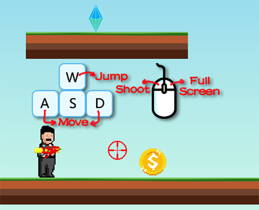

# 金币射手50 - Coin Marksman 50

金币射手50是一款使用Phaser 3开发的2D射击游戏，玩家需要控制射手射击金币，当金币砸中水晶后即可进入下一关。

点击下方链接进入游戏：

[金币射手50](https://jacknoire.github.io/Coin-Marksman-50/)

Coin Marksman 50 is a 2D shooter game created with Phaser 3. In this game, players need to control a shooter to aim and shoot at a coin. The goal is to hit the coin against a sparkling crystal to advance to the next level.

Click the link below to start the game:

[Coin Marksman 50](https://jacknoire.github.io/Coin-Marksman-50/)

